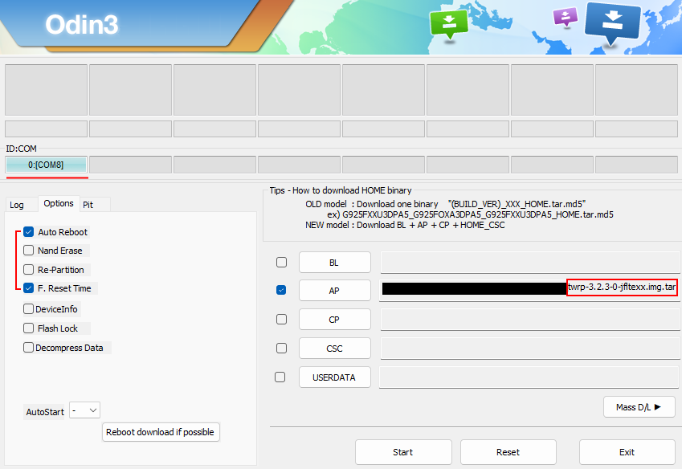
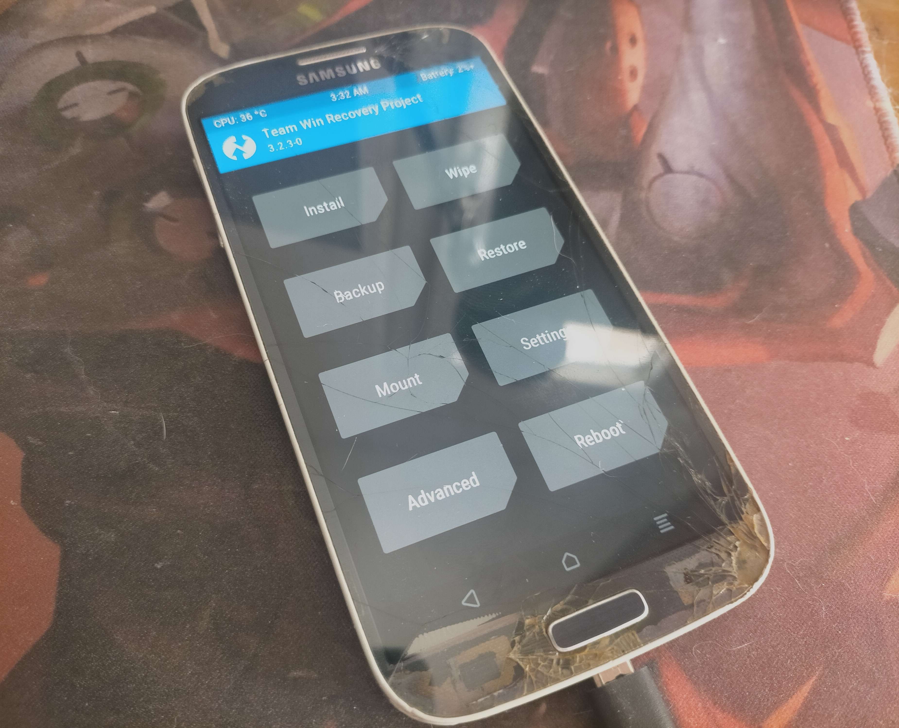

# Repurposing an Old Smartphone for Cybersecurity Projects: Galaxy S4 Case Study

In the world of cybersecurity and decentralized communication technologies, projects like **ATAK** (Android Team Awareness Kit) and **Meshtastic** are attracting growing interest.

Initially, I thought they required specialized hardware, but it turns out that a simple **Android smartphone** can be enough to start experimenting.

What if, instead of letting our old phones age in a drawer, we gave them a second useful life?

Here's my experience with a nearly ten-year-old **Samsung Galaxy S4**, and how I managed to refurbish it to test these tools.

## Hardware Diagnostics

I took out my old Galaxy S4 to check if it would still work.

- **Screen Condition:** Cracked but touchscreen functional.
- **Battery:** No deformation, no swelling—surprising after ten years of inactivity.
- **Charging Cable:** An old micro-USB found in my cable crate.

> In thirty minutes, the phone was 80% charged and ready to go.

## First problem: the lock screen

The smartphone boots up without a problem... but a **lock pattern** I'd forgotten six years ago was blocking access.

After some research, I discovered a trick:

After five failed attempts, a 30-second delay is required.

At this point, an **"Emergency Code"** option appears.

By testing my old codes, I finally found the correct one and accessed the device.

The phone was working again, with its music, text messages, and old photos.

## Second problem: a PIN code that doesn't exist

After disabling the pattern, I locked the screen to test... but this time, I was asked for a **PIN code**.
I couldn't enter it correctly: I'd never set one!

Many forums suggested a **complete reset** as the only solution, which would have erased all my data. But after several hours of searching, I came across an old Reddit thread where someone had encountered the exact same problem.

> This is where the technical part begins.

## The Hack: Bypassing the Android Lock

To recover my data without a reset, I had to go through a root and recovery flashing process:

1. **Install Odin**

- **What is it?**
  Windows software developed by Samsung, allowing you to flash ROMs and system images on Galaxy phones.
- Useful for installing a **custom recovery** like TWRP.

2. **Download TWRP (Team Win Recovery Project)**

- **What is it for?**
  An alternative recovery offering advanced access to the file system, allowing you to manipulate partitions, install custom ROMs, and access internal files.

3. **Unlocking PC to Smartphone communication**

The phone wasn't recognized initially.

Solution: Install **Samsung USB Driver for Mobile Phones.**

Need to disable **Windows kernel integrity** to allow driver installation.

4. **Flash the correct recovery**

After several unsuccessful attempts (wrong TWRP version, unusable screen), I finally found a compatible generic version.

Tip: always check the exact version for your model before flashing.

5. **Deleting the lock files**

From TWRP recovery mode:

Navigate to **/data/system/**

Delete the following files:

- `gesture.key`
- `password.key`
- `locksettings.db`
- `locksettings.db-wal`
- `locksettings.db-shm`

> After rebooting, the phone no longer asked for a password.

## Final Results

In less than a day, I was able to regain access to my Galaxy S4, **back up my data**, and prepare to install tools like ATAK or Meshtastic.

## Other usecases: Rooting your device

Using the exact same procedure, you can use Odin to flash root software to your device instead of TWRP.

## Cybersecurity Watch Points

- **Privacy:** These manipulations demonstrate that older locking systems are vulnerable. With time and a few tools, a motivated attacker can bypass the security.
- **Obsolescence:** Android 5 or 6 no longer offer security updates. For network use (ATAK, Meshtastic), the device must be isolated from the internet and mitigate risks, especially if your device is rooted.
- **Best Practices:**

  - **Always encrypt sensitive data.**
  - Avoid using an old phone as a personal device.
  - Reserve these devices for **testing, research, and controlled environments.**

## Conclusion

Reusing an old smartphone can be an excellent way to experiment with secure communication tools like **ATAK** or **Meshtastic.**
Beyond the technical aspects, this experiment highlights an important truth: **the security of a system depends as much on its software as on its hardware longevity.**
