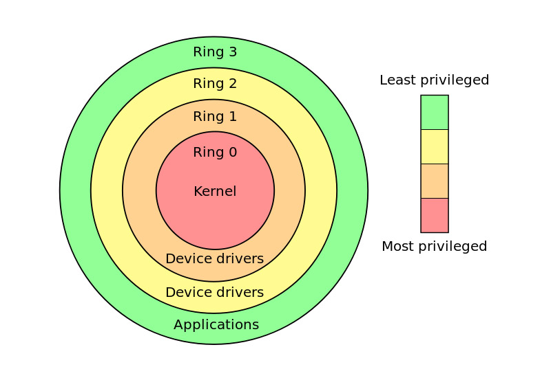
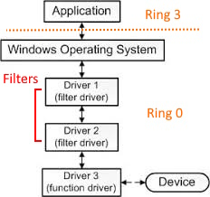

::github{repo="Ena-Shepherd/Awesome-Windows-Drivers-Development"}

 

# What's a driver ?

A **driver** is a program that runs on your PC and is primarily intended to enable interaction with hardware or virtual devices.
It acts as the translator between the operating system (and applications) and the device: turning low-level signals, registers and interrupts into actions and events the OS can understand.

A few months back, I got *gently* introduced to device drivers for my missions at work. Without prior experience or knowledge about the subject, the slap in the face got real fast.

This post sums up how I approached the learning path, lists the basics, explains why drivers matter, and shows how you can use the repository.

## When do you want a driver ?

In my case I needed a driver to implement a **virtual USB** device. Generally, you want to write or use a driver when:

* **You need to talk to hardware devices** (access registers, handle interrupts, use DMA, etc.).
* **You need to expose a virtual device to the OS** (virtual USB, virtual NIC, virtual storage).
* **You want to interact with the operating system at a low level** (filesystem extensions, kernel hooks, power management, etc.).
* **You need very low latency or high throughput** that user-mode APIs cannot provide reliably.
* **You want to extend, intercept or augment other drivers** (filter drivers, shims).
* **You need kernel-level visibility or enforcement** (EDR, anti-cheat, integrity monitoring).

If your requirements don't match any of the above, prefer user-mode code, it will be safer and easier to develop.

## User mode vs kernel mode

You can picture access control as concentric rings: the closer you get to the center (ring 0), the more privileges you have.

### User-land (ring 3)

* Normal applications, libraries, and most drivers running in your user session.
* **User-mode drivers** on Windows are almost always implemented as **DLLs** loaded into a host process (for example, `WUDFHost.exe` for UMDF). These are easier to debug and less likely to crash the whole machine.
* Many Windows **services** are user-mode DLLs hosted in processes like `svchost.exe`. These services interact with drivers using standard user-to-kernel communication (DeviceIoControl, named pipes, etc.), but remain in ring 3.
* Typical file type: **.dll**

### Kernel-land (ring 0)

* The kernel is the most privileged layer: it manages memory, hardware, and runs core OS services.
* **Kernel-mode drivers** run in this privileged context and can access hardware directly — which also means a bug can crash the whole system (BSOD on Windows).
* Kernel drivers are installed and started via the Service Control Manager (SCM) but execute in ring 0 as `.sys` files.
* Typical file type: **.sys**

Since drivers are often aimed at talking to hardware, kernel drivers are typically used when you need direct or privileged access that user-mode code cannot safely provide.

# Why it's important ?

### Hardware / system

Devices like your keyboard, mouse, Wi‑Fi card or USB stick produce signals the OS doesn't understand directly. Drivers *translate* those signals into events and data the OS and applications can use. They also manage device state, power, and protocol compliance.

Without drivers, the OS cannot enumerate devices, receive input, or move data to/from hardware.

### WDF vs WDM toolchain

> You will likely never use WDM unless you're working on something really exotic

* **WDF (Windows Driver Frameworks)** includes **KMDF** (kernel-mode) and **UMDF** (user-mode). WDF provides higher-level abstractions and helpers so you focus on device logic rather than plumbing.
* **WDM (Windows Driver Model)** is the older, lower-level model. Writing WDM drivers often means dealing with a lot of boilerplate and edge cases yourself. It is also **more free**: you can do almost anything in kernel space without the abstractions or restrictions of WDF, which gives flexibility but increases risks.

In practice: **WDM is more barebones, more flexible, but more error-prone, WDF (KMDF/UMDF) is safer, more structured, and recommended for modern development**.

## Cybersecurity

Drivers run at **high privilege**, which makes them useful to both defenders and attackers.

* **Offensive use**: attackers may abuse vulnerable or legitimately signed drivers to execute code in kernel mode, hide artifacts, or persist (rootkits). Collections like "Living Off The Land Drivers" (LOLDrivers) catalog drivers that have been observed abused or weaponized.
* **Defensive use**: security products (EDR, anti-cheat) sometimes deploy kernel drivers to obtain visibility or enforcement that cannot be achieved from user-mode.

> Everyone fights for the ring-0 (kernel access)

Because of the risk, writing and auditing drivers requires extra caution: memory safety, strict validation of inputs, and minimal privilege usage are essential.

## Special types of drivers

* **Function (device) drivers**: implement the logic for a specific device.
* **Bus drivers**: manage a bus (PCI, USB host controller, virtual bus) and detect child devices.
* **Filter drivers**: attach to an existing driver stack to observe, modify, or augment I/O. Filters can be *upper* or *lower* filters and are a common way to add functionality without rewriting the main driver.
* **Miniport drivers**: implement hardware-specific bits underneath a generic port/driver model (common in networking and storage).
* **File system drivers**: implement or extend filesystems and require careful interaction with OS internals.

**Filter drivers** deserve special mention: they intercept I/O requests between the OS and a device driver. They operate in a stack (driver A -> filter -> driver B), can inspect or modify requests, and are often used to bridge userland requirements and kernel operations.

## Communication: IOCTLs, IRPs and their role

* **IRP (I/O Request Packet)**: kernel-internal structure that represents an I/O operation (read, write, device control). Kernel-mode drivers receive and handle IRPs.
* **IOCTL (I/O control code)**: a device-specific control command sent from user space. The OS wraps the request into an IRP and delivers it to the driver.

Frameworks like KMDF/UMDF provide IO queues and helpers to simplify asynchronous/synchronous I/O handling, but the underlying concepts (IRP/IOCTL) remain central.

# Safety, testing and tips

* **Develop in a VM with snapshots** kernel bugs crash the machine, and a VM let you recover fast.
* **Use the WDK + Visual Studio** and prefer KMDF/UMDF over raw WDM.
* **Use WinDbg and symbol servers** for kernel debugging; your VM + WinDbg setup is the standard approach for kernel development.
* **Driver signing**: production kernel drivers must be signed. For development you’ll use test-signing environments.
* **Prefer user-mode drivers when possible** — they’re simpler, safer, and easier to debug.

## Introduction to WinDbg

**WinDbg** is Microsoft’s debugger for both user-mode and kernel-mode applications. For driver developers, it is the tool of choice for inspecting what happens inside the kernel:

* It can attach to a virtual machine (or another computer) and step through kernel code, set breakpoints, and inspect memory.
* It integrates with Microsoft’s symbol servers to show function names and structures.
* It is invaluable for analyzing **Blue Screen of Death (BSOD) crash dumps**, which often result from driver bugs.
* Combined with a VM, WinDbg provides a safe loop: write driver, load in VM, trigger bug, inspect with WinDbg, fix, repeat.

If you want to dig into kernel internals, WinDbg is essential — it gives you visibility that no user-mode debugger can provide.

# Quick glossary

* **Driver**: software that lets the OS and applications interact with hardware or virtual devices.
* **.sys**: kernel-mode driver file on Windows.
* **.dll**: user-mode driver component usually loaded into a host process.
* **svchost.exe**: generic host process for user-mode service DLLs.
* **WDF**: Windows Driver Frameworks (KMDF + UMDF).
* **WDM**: older Windows Driver Model, more flexible but risky.
* **IRP**: I/O Request Packet (kernel I/O message).
* **IOCTL**: device-specific control operation from user space.
* **WinDbg**: Microsoft’s debugger, essential for kernel and driver development.

# Want to dive deeper?

> Check out my repository for all the driver resources I’ve gathered.
> ::github{repo="Ena-Shepherd/Awesome-Windows-Drivers-Development"}

If you want to read about how i conduct unit tests in the kernel, read my other post:  
[**Unit Testing kernel drivers**](https://ena-shepherd.github.io/blog/posts/testing-complex-architectures-kernel-drivers/)
