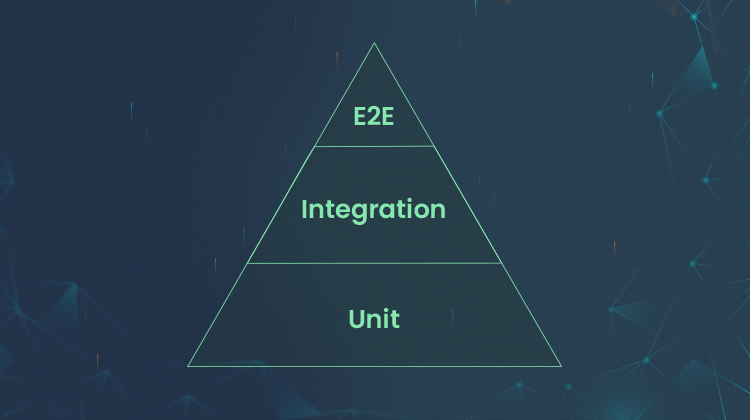
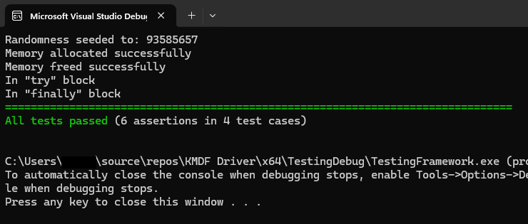
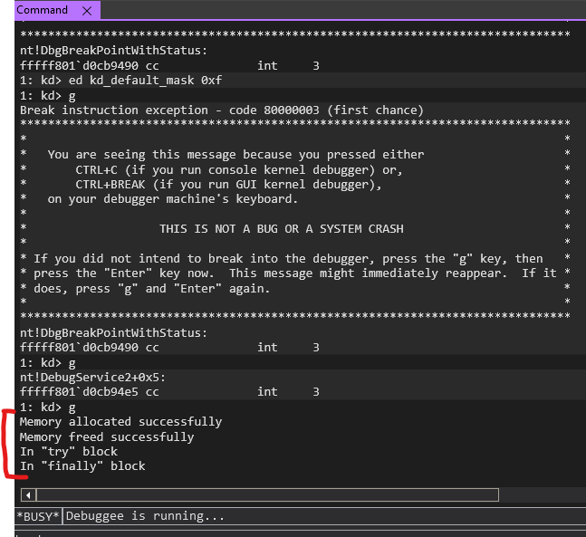
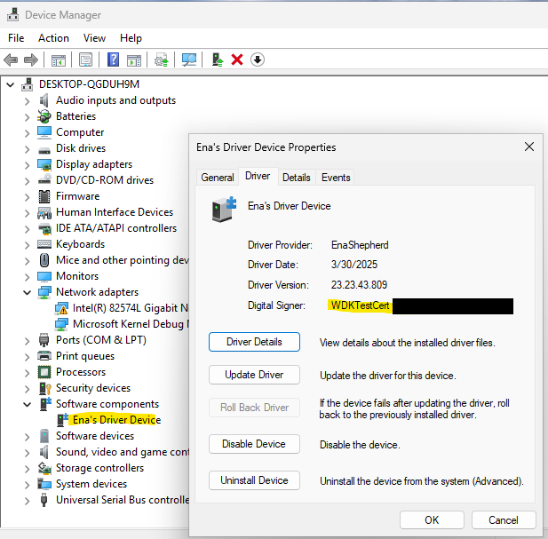
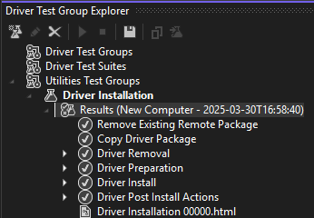

## **Analysis of Testing methods**

## **The Test pyramid: A classic model**

We often refer to the **Test pyramid** to structure different types of tests:

- **Unit Tests (base of the pyramid):** fast, automated, covering small parts of the code.
- **Integration Tests (middle):** ensure that different modules work well together.
- **End-to-end Tests (top):** simulate real scenarios but are slower and more complex to set up.

The idea is to have many unit tests, fewer integration tests, and even fewer end-to-end tests, to strike a good balance between speed and coverage.

---

## **Two ways to do Unit Testing**

There are two main approaches:

- **Classic Tests** that check a function in interaction with other parts of the program.
- **Isolated Tests with mocks,** where all dependencies are replaced with simulated objects to test only one unit at a time.

---

## **The problems of Over-isolated Tests**

If we use too many mocks, we end up with tests that break at the slightest code change, are hard to read because of simulated objects, and make the project more rigid, since every refactor forces us to rewrite everything.

---

## **A more flexible approach: Test behavior, not implementation**

Test **what the code does** rather than **how it does it**.

Test the **public APIs of a module** instead of testing each tiny function separately.

Why is this better?

- **Public APIs rarely change,** so tests remain valid longer.
- It gives us **flexibility,** since we can change the module internals without impacting tests.
- We need **fewer mocks,** so tests are clearer and easier to maintain.

---

## **Project context: Kernel driver development as a perfect usecase for the entire Testing pyramid**

Kernel driver development is a major technical challenge. Unlike user-mode applications, a single mistake can trigger a **bug check (Blue Screen of Death)** and freeze the entire system. Debugging such a crash requires a **kernel debugger like WinDbg** and a separate test machine, physical or virtual.

The purpose of this write-up is to illustrate why a **full test suite**—from **unit tests to end-to-end tests**—is essential to ensure stability and reliability before deploying a driver.

### **1. Driver code separation**

The idea is to separate the driver’s complex logic and internal state from the rest of the kernel-dependent code. This separation allows us to write much of the code in a user-mode environment before integrating it into a kernel-mode driver.

### **2. User-Mode development and Testing**

- Complex code (data structures, caching, processing algorithms, etc.) is implemented as a user-mode program.
- A standard Windows executable is used to run this code and validate its behavior.
- User-mode Testing allows access to advanced debugging tools like **WinDbg, Visual Studio Debugger,** and other test frameworks.

### **3. Kernel call simulation**

- To ensure the driver code will work in kernel mode, we create **mocks** or **simulations** of Windows kernel APIs (`ZwReadFile`, `ExAllocatePool2`).
- These mocks replace system calls with equivalent user-mode functions such as `ReadFile` and `malloc`.

### **4. User-Mode Testing**

- Automated tests with tools like **Catch2** verify stability and robustness.
- In user mode, debugging is faster and safer since crashes don’t freeze the whole system.

### **5. Porting to Kernel-Mode**

- Once validated in user mode, the code is integrated into the kernel-mode driver.
- Mocked calls are replaced with real Windows kernel calls.
- Additional tests are run in kernel mode with **WinDbg (Kernel Debugging mode)** and **Driver Test Group Explorer** to ensure proper operation.

### **Advantages of the method**

- Faster, more efficient debugging in user mode
- Reduced system crashes
- Code reuse between user-mode and kernel versions
- More agile development with automated testing

In short, this method structures the code to **decouple business logic from kernel-dependent code**, enabling a more stable and efficient testing environment before kernel integration.

---

## **Step-by-step demonstration:**

## **1. Unit Tests - Verifying critical components**

Unit Tests validate **each driver function in isolation**. In a kernel driver, functions like **memory allocation (ExAllocatePool2)** or IRP handling must be thoroughly tested, since an error at this level can corrupt the kernel.

With **Catch2**, we can run these tests in a simulated environment, without loading the driver, preventing unnecessary crashes and long deployment times.

**Role:** Detect and fix the most basic bugs without impacting the system.

---

## **2. Integration Tests - Verifying OS interactions**

A driver doesn’t work alone: it interacts with Windows through **the PnP manager, the IRP stack, and other kernel services**.

Integration tests ensure these interactions work correctly.

With **WinDbg**, we can monitor driver behavior when loaded, verifying its initialization and how it handles system requests.

**Role:** Ensure the driver integrates properly with the OS without causing instability.

---

## **3. System Tests - Simulating scenarios**

System tests simulate real-world cases like **sleep, resume, or hot removal of a device**. A bug here can freeze the entire system.

These events can be tested manually via **Device Manager**, or automatically by redeploying from Visual Studio.

**Role:** Test driver robustness under system-level events.

---

## **4. End-to-End Tests - Validating global functionality and deployment**

End-to-end tests **evaluate the driver in a real environment**.

The **Driver Test Group Explorer** is crucial for automating these tests and providing an overall view of driver behavior.

Besides validating functionality, these tests also **prepare deployment** by testing driver installation and updates across different hardware configurations.

This tool also enables **stability testing** with built-in fuzzing tests.

Poorly prepared deployment can cause **incompatibilities, installation errors, or system crashes (cf. Crowdstrike).** Testing this phase anticipates such issues before production.

**Role:** Verify that the driver performs under load, installs cleanly, and updates safely.

---

::github{repo='Ena-Shepherd/Unit-Testing-Kernel-Drivers'}

## **Conclusion - Kernel driver Testing: An absolute necessity**

Developing a kernel driver without a **rigorous testing strategy** is extremely risky. Every bug can cause a **system crash**, making debugging long and complex.

By applying a complete approach, **unit, integration, system, and end-to-end tests**, we drastically reduce risks before deployment, ensuring **stability, performance, and security**.
